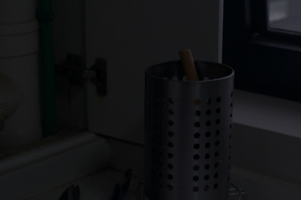

<h1 align="center">Representative Color Transform for Image Enhancement</h1>
<p> An unofficial PyTorch implementation of <a href="https://openaccess.thecvf.com/content/ICCV2021/papers/Kim_Representative_Color_Transform_for_Image_Enhancement_ICCV_2021_paper.pdf">Kim et al. "Representative Color Transform for Image Enhancement"</a>, ICCV2021. </p>
<p> For more information about our implementation, you can also read <a href="https://thanosm97.github.io/Representative-Color-Transform/">our blog.</a></p>

<h2> RCTNet </h2>
<p align="justify">In Kim et al. (2021), a novel image enhancement approach is introduced, namely
            Representative Color Transforms, yielding large capacities for color transformations.
            The overall proposed network comprises of four components: encoder, feature fusion, global RCT, and local
            RCT and is depicted in <a href="#fig1">Figure 1</a>. First the encoder is utilized
            for extracting high-level context information, which in is in turn leveraged for determining representative
            and transformed (in RGB) colors for the input image. Subsequently,
            an attention mechanism is used for mapping each pixel color in the input image to the representative colors,
            by computing their similarity. The last step involves the
            application of representative color transforms using both coarse- and fine-scale features from the feature
            fusion component to obtain enhanced images from the global and
            local RCT modules, which are combined to produce the final image.</p>
            
<figure id="fig1">
    
    <p align="center">Figure 1: An overview of RCTNet's architecture.</p>
</figure>

<h2> Experiments </h2>

<h3>Dataset</h3>
<p align="justify">The LOw-Light (LOL) dataset [<a href="https://daooshee.github.io/BMVC2018website/">Wang et al. (2004)</a>] for image enhancement in low-light scenarios was used for the purposes of our experiment. It is composed of a training partition, containing 485 pairs of low- and normal-light image pairs, and a test partition, containing 15 such pairs. All the images have a resolution of 400×600. For the purposes of training, all images were randomly cropped and rotated by a multiple of 90 degrees.</p>

<h3>Quantitative Evaluation</h3>
<p align="justify">The results, in terms of the PSNR and SSIM evaluation metrics, calculated for our implementation of RCTNet are depicted in Table 1, along with results of competing image enhancement methods and the official implementation of RCTNet, as reported in Kim et al. (2021). It becomes evident that our results do not approximate those reported for the official implementation for both examined metrics.</p>

<table align="center" width="75%" id="tab1">                    
                    <thead>
                        <tr>
                            <th>Method</th>
                            <th>PSNR</th>
                            <th>SSIM</th>
                        </tr>
                    </thead>
                    <tbody>
                        <tr>
                            <td>NPE [<a href="#17">Wang et al. (2013)</a>]</td>
                            <td>16.97</td>
                            <td>0.589</td>
                        </tr>
                        <tr>
                            <td>LIME [<a href="#18">Guo et al. (2016)</a>]</td>
                            <td>15.24</td>
                            <td>0.470</td>
                        </tr>
                        <tr>
                            <td>SRIE [<a href="#19">Fu et al. (2016)</a>]</td>
                            <td>17.34
                            <td>0.686</td>
                        </tr>
                        <tr>
                            <td>RRM [<a href="#20">Li et al. (2016)</a>]</td>
                            <td>17.34</td>
                            <td>0.686</td>
                        </tr>
                        <tr>
                            <td>SICE [<a href="#21">Cai et al. (2018)</a>]</td>
                            <td>19.40</td>
                            <td>0.690</td>
                        </tr>
                        <tr>
                            <td>DRD [<a href="#15">Wei et al. (2018)</a>]</td>
                            <td>16.77</td>
                            <td>0.559</td>
                        </tr>
                        <tr>
                            <td>KinD [<a href="#22">Zhang et al. (2019)</a>]</td>
                            <td>20.87</td>
                            <td>0.802</td>
                        </tr>
                        <tr>
                            <td>DRBN [<a href="#4">Yang et al. (2020)</a>]</td>
                            <td>20.13</td>
                            <td><b>0.830</b></td>
                        </tr>
                        <tr>
                            <td>ZeroDCE [<a href="#11">Guo et al. (2020)</a>]</td>
                            <td>14.86</td>
                            <td>0.559</td>
                        </tr>
                        <tr>
                            <td>EnlightenGAN [<a href="#23">Jiang et al. (2021)</a>]</td>
                            <td>15.34</td>
                            <td>0.528</td>
                        </tr>
                        <tr>
                            <td>RCTNet [<a href="#1">Kim et al. (2021)</a>]</td>
                            <td><u>22.67</u></td>
                            <td>0.788</td>
                        </tr>
                        <tr>
                            <td>RCTNet (ours)* </td>
                            <td>18.81</td>
                            <td>0.732</td>
                        </tr>
                        <tr>
                            <td>RCTNet + BF [<a href="#1">Kim et al. (2021)</a>]</td>
                            <td><b>22.81</b></td>
                          <td>0.827</td>
                        </tr>
                    </tbody>                
                </table>
                <p align="center">Table 1: Quantitative comparison on the LoL dataset. The best results are boldfaced. </p>
                
<p align="justify"> Interestingly, the results of Table 1 deviate significantly in case the augmentations proposed by the authors (random cropping and random rotation by a multiple of 90 degrees) are also used during the evaluation. This finding indicates that the model favours augmented images, since during training we performed augmentation operations on all input images and for every epoch. While the authors refer to the same augmentations, they do not specify the frequency, with which those augmentations were performed. This phenomenon becomes more evident by looking at the quantitative results, when augmentations were used on the test images, as shown in Table 2. </p>

<table align="center">
    <thead>
        <tr>
            <th>Evaluation Metric</th>
            <th>Mean</th>
            <th>Standard Deviation</th>
            <th>Max</th>
            <th>Min</th>
        </tr>
    </thead>
    <tbody>
        <tr>
            <td>PSNR</td>
            <td>20.522</td>
            <td>0.594</td>
            <td>22.003</td>
            <td>18.973</td>
        </tr>
        <tr>
            <td>SSIM</td>
            <td>0.816</td>
            <td>0.009</td>
            <td>0.839</td>
            <td>0.787</td>
        </tr>
    </tbody>
</table>
<p align="center">Table 2: Mean, standard deviation, maximum, and
        minimum values for PSNR and SSIM, for 100 executions with <br> different random seeds, when augmentations are also included in the test set, using our implementation of RCTNet.</p>
        
<h3> Qualitative Evaluation </h3>
<p align="justify"> Some image enhancement results of the implemented RCTNet are shown below, compared to the low-light input images and the ground-truth normal-light output images. From these examples it becomes evident that RCTNet has successfully learned how to enhance low-light images, achieving comparable results to the ground-truth images in terms of exposure and color-tones. Nevertheless, the produced images are slightly less saturated with noise being more prominent. It was conjectured that by training the network for more epochs, some of these limitations could be alleviated. It is also observed that RCTNet fails to extract certain representative colors that are only available in small regions of the input image (e.g. the green color for the 4th image). </p>

<table id="tab3">
                                    <thead>
                                        <tr>
                                            <th>Input</th>
                                            <th>RCTNet</th>
                                            <th>Ground-Truth</th>
                                        </tr>
                                    </thead>
                                    <tbody>
                                        <tr>
                                            <td></td>
                                            <td></td>
                                            <td></td>
                                        </tr>
                                        <tr>
                                            <td></td>
                                            <td></td>
                                            <td></td>
                                        </tr>
                                        <tr>
                                            <td></td>
                                            <td></td>
                                            <td></td>
                                        </tr>
                                        <tr>
                                            <td></td>
                                            <td></td>
                                            <td></td>
                                        </tr>
                                        <tr>
                                            <td></td>
                                            <td></td>
                                            <td></td>
                                        </tr>
                                    </tbody>
                                </table>
                                
                                
<h2> Scripts </h2>
<h3> Training </h3>
      <ol type = "1">
  <li>Download the official LoL dataset from <a href="https://daooshee.github.io/BMVC2018website/">here</a>.</li>
  <li>Use the <a href="train.py">train.py</a> script</li>
      </ol>
      
      
  ```
  $ python train.py -h
        usage: train.py [-h] --images IMAGES --targets TARGETS [--epochs EPOCHS] [--batch_size BATCH_SIZE] [--lr LR]
                        [--weight_decay WEIGHT_DECAY] [--config CONFIG] [--checkpoint CHECKPOINT]
                        [--checkpoint_interval CHECKPOINT_INTERVAL] [--device {cpu,cuda}]

        options:
          -h, --help            show this help message and exit
          --images IMAGES       Path to the directory of images to be enhanced
          --targets TARGETS     Path to the directory of groundtruth enhanced images
          --epochs EPOCHS       Number of epochs
          --batch_size BATCH_SIZE
                                Number of samples per minibatch
          --lr LR               Initial Learning rate of Adam optimizer
          --weight_decay WEIGHT_DECAY
                                Weight decay of Adam optimizer
          --config CONFIG       Path to configurations file for the RCTNet model
          --checkpoint CHECKPOINT
                                Path to previous checkpoint
          --checkpoint_interval CHECKPOINT_INTERVAL
                                Interval for saving checkpoints
          --device {cpu,cuda}   Device to use for training
  ```
  
  <h3>Evaluation</h3>
        <ol type = "1">
  <li>Download the official LoL dataset from <a href="https://daooshee.github.io/BMVC2018website/">here</a>.</li>
  <li>Download the weights for our pre-trained model from <a href="https://drive.google.com/file/d/1NYQrYkOfQWndkS03-sAgEmq23Pi2lWQf/view?usp=sharing">here</a>.</li>
  <li>Use the <a href="eval.py">eval.py</a> script.</li>
      </ol>
      
 
```
$ python eval.py -h
usage: eval.py [-h] --images IMAGES --targets TARGETS --save SAVE --checkpoint CHECKPOINT [--config CONFIG]
               [--batch_size BATCH_SIZE] [--nseeds NSEEDS] [--device {cpu,cuda}]

options:
  -h, --help            show this help message and exit
  --images IMAGES       Path to the directory of images to be enhanced
  --targets TARGETS     Path to the directory of groundtruth enhanced images
  --save SAVE           Path to the save plots and log file with metrics
  --checkpoint CHECKPOINT
                        Path to the checkpoint
  --config CONFIG       Path to configurations file for the RCTNet model
  --batch_size BATCH_SIZE
                        Number of samples per minibatch
  --nseeds NSEEDS       Number of seeds to run evaluation for, in range [0 .. 1000]
  --device {cpu,cuda}   Device to use for training
```


<h3> Enhance images </h3>
        <ol type = "1">
  <li>Download the weights for our pre-trained model from <a href="https://drive.google.com/file/d/1NYQrYkOfQWndkS03-sAgEmq23Pi2lWQf/view?usp=sharing">here</a>.</li>
  <li>Use the <a href="enhance.py">enhance.py</a> script.</li>
      </ol>
      
      
```
$ python enhance.py -h
usage: enhance.py [-h] --image IMAGE --checkpoint CHECKPOINT [--config CONFIG] [--batch_size BATCH_SIZE]
                  [--device {cpu,cuda}]

options:
  -h, --help            show this help message and exit
  --image IMAGE         Path to an image or a directory of images to be enhanced
  --checkpoint CHECKPOINT
                        Path to previous checkpoint
  --config CONFIG       Path to configurations file for the RCTNet model
  --batch_size BATCH_SIZE
                        Number of samples per minibatch
  --device {cpu,cuda}   Device to use for training
```


<h2> References </h2>


```
@INPROCEEDINGS{9710400,  
  author={Kim, Hanul and Choi, Su-Min and Kim, Chang-Su and Koh, Yeong Jun},  
  booktitle={2021 IEEE/CVF International Conference on Computer Vision (ICCV)},   
  title={Representative Color Transform for Image Enhancement},   
  year={2021},  
  volume={},  
  number={},  
  pages={4439-4448},  
  doi={10.1109/ICCV48922.2021.00442}
},

@inproceedings{Chen2018Retinex,
  title={Deep Retinex Decomposition for Low-Light Enhancement},
  author={Chen Wei, Wenjing Wang, Wenhan Yang, Jiaying Liu},
  booktitle={British Machine Vision Conference},
  year={2018},
} 
```
